# MachineLearning_2
## a sample dataset of an online retail

the usful libraries in this project :
- Pandas
- Matplotlib
- Numpy

## reading our data:

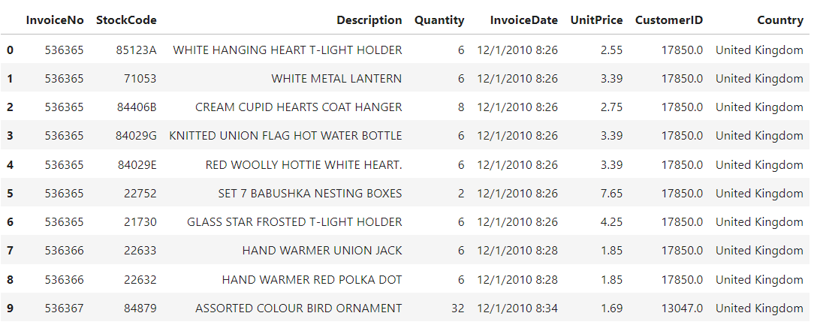

we have a dataframe that shows our monthly revenue :

Revenue = Active Customer Count * Order Count * Average Revenue per Order

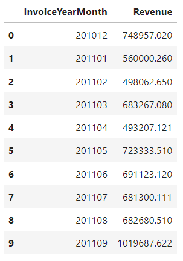

Scatter plot:

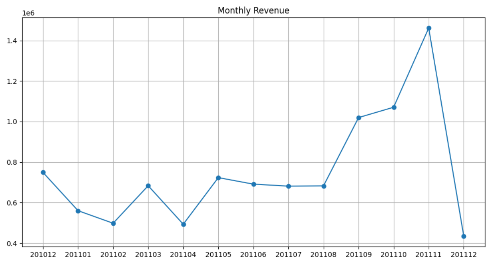

## Monthly Revenue Growth Rate :

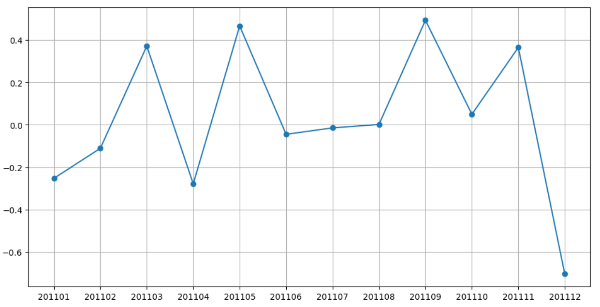

- we need to identify what exactly happened on April!!!

## The bar plot of Monthly Active Customers :

- we will be focusing on UK data only (which has the most records).
- In April, Monthly Active Customer number dropped to 817 from 923 (-11.5%).

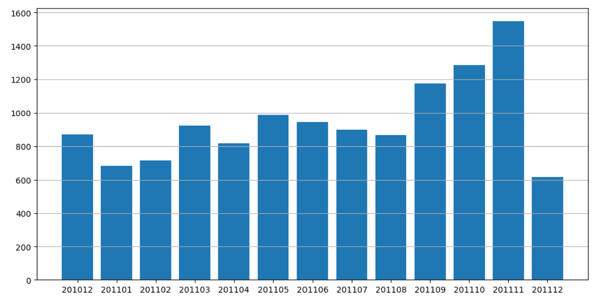

## bar plot of Monthly Order Count :

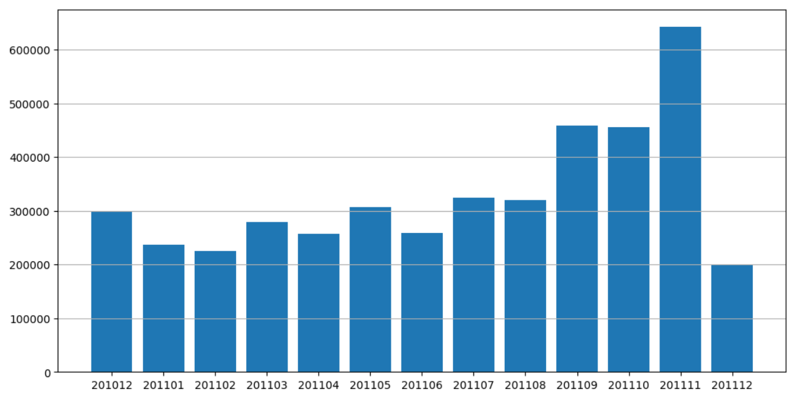

## Average Revenue per Order :

- we need to calculate the average of revenue for each month

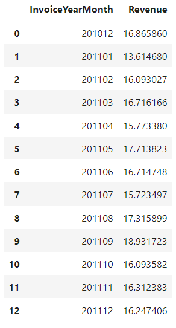

### its bar plot :

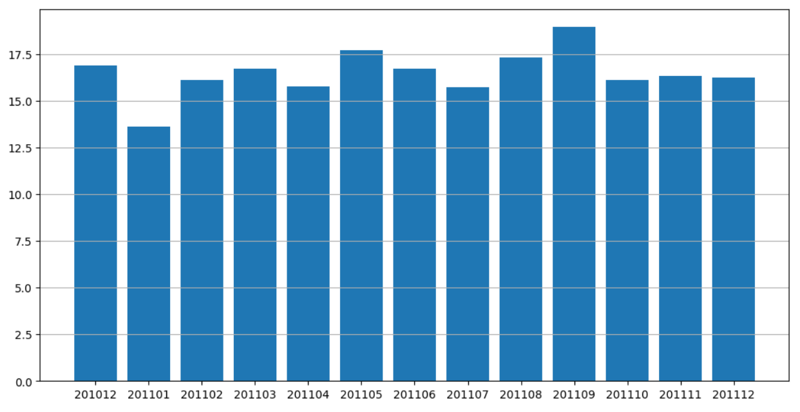

---
### New Customer Ratio :
- In our dataset, we can assume a new customer is whoever did his/her first purchase in the time window we defined.

- We will be using .min() function to find our first purchase date for each customer and define new customers based on that

### Dataframe output after merging with First Purchase Date:

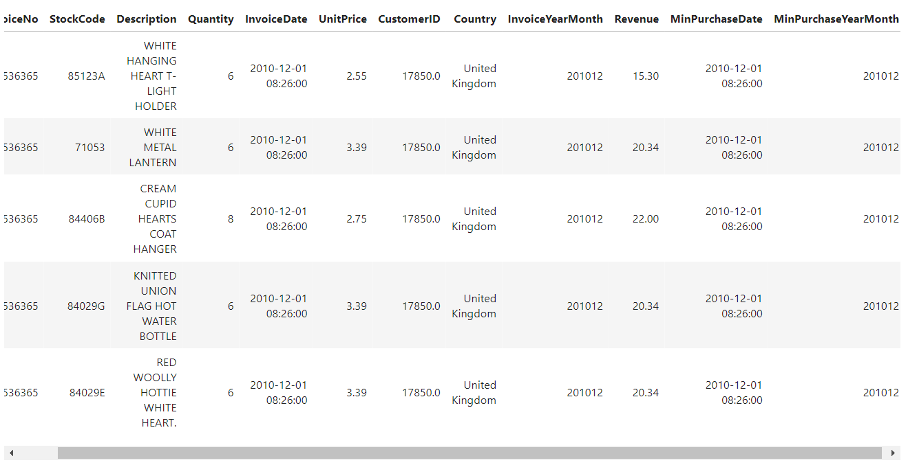

### Existing & New Customers scatter plot :

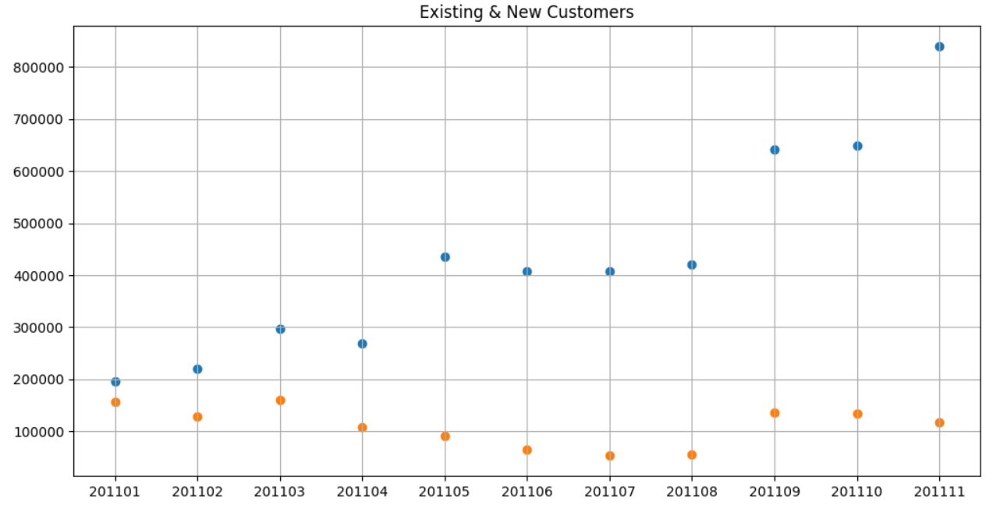

### New Customer Ratio

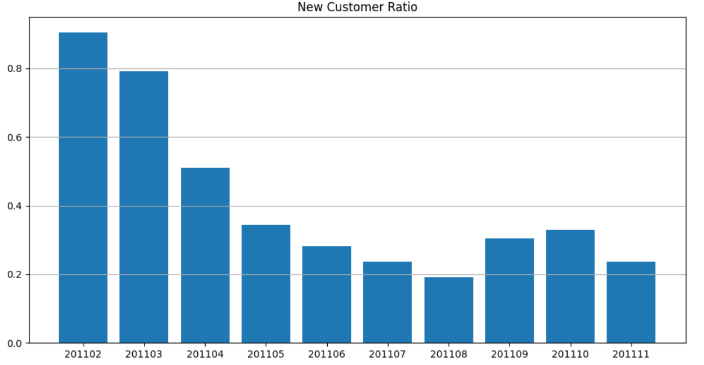

## Retention table with crosstab() function :

Retention table shows us which customers are active on each month (1 stands for active).

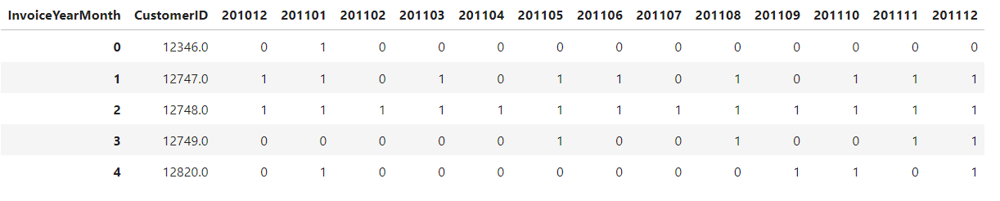

### calculate Retention Rate :

- Monthly Retention Rate = Retained Customers From Prev. Month /Active Customers Total

- We will be using crosstab() function of pandas which makes calculating Retention Rate super easy.

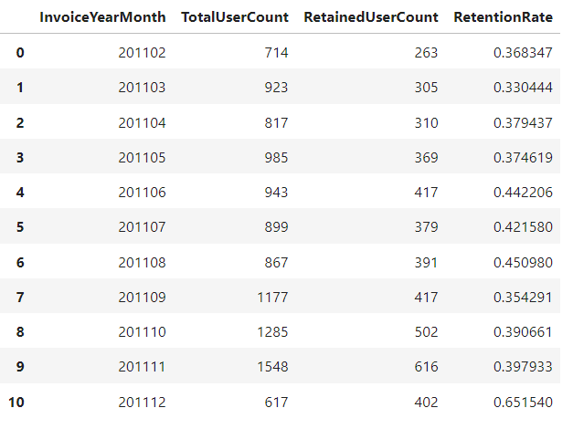

### Retention Rate plot :

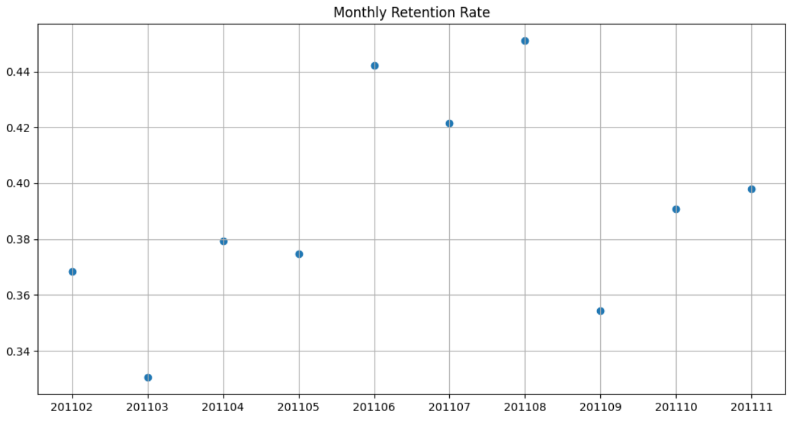

### showing new cohort based retention table :

Cohort Based Retention Rate

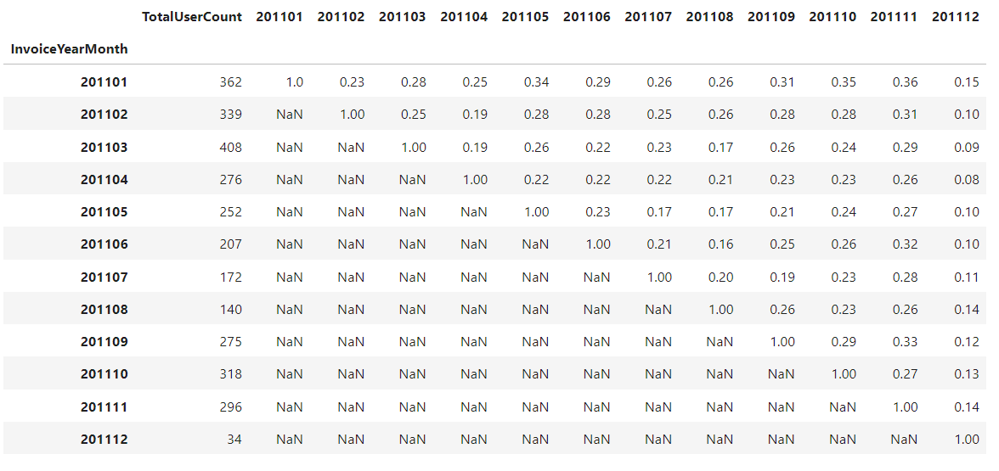

